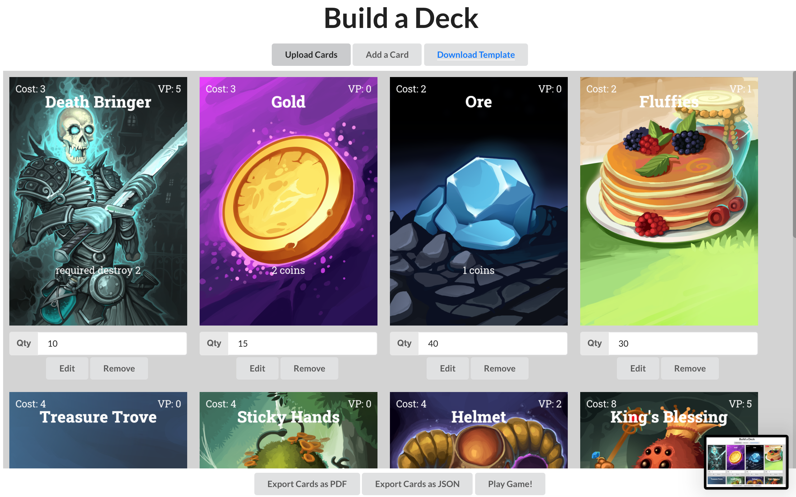
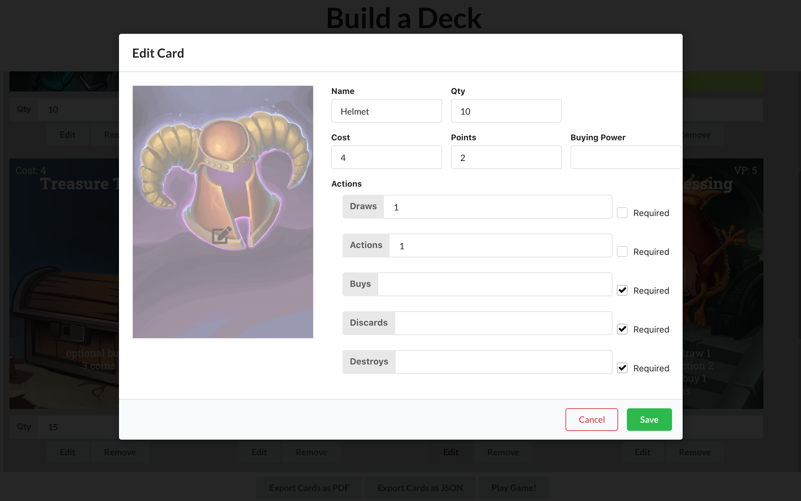
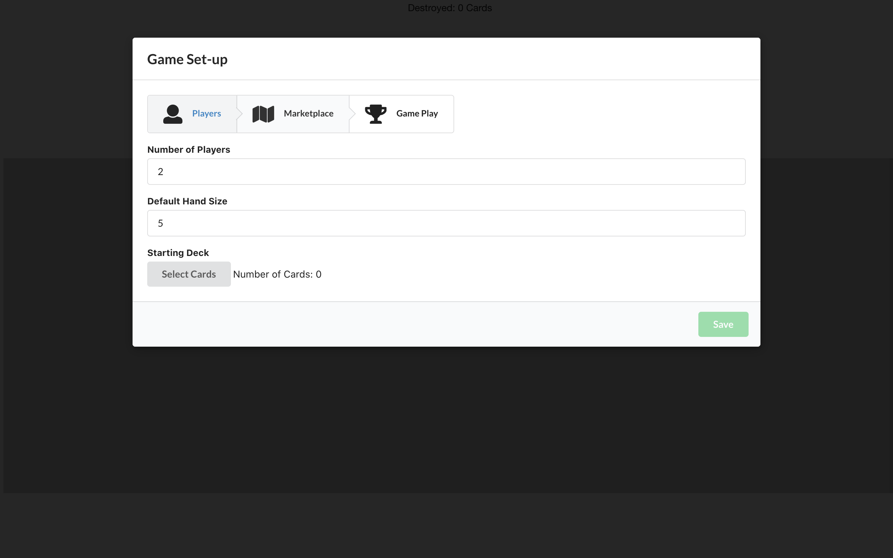
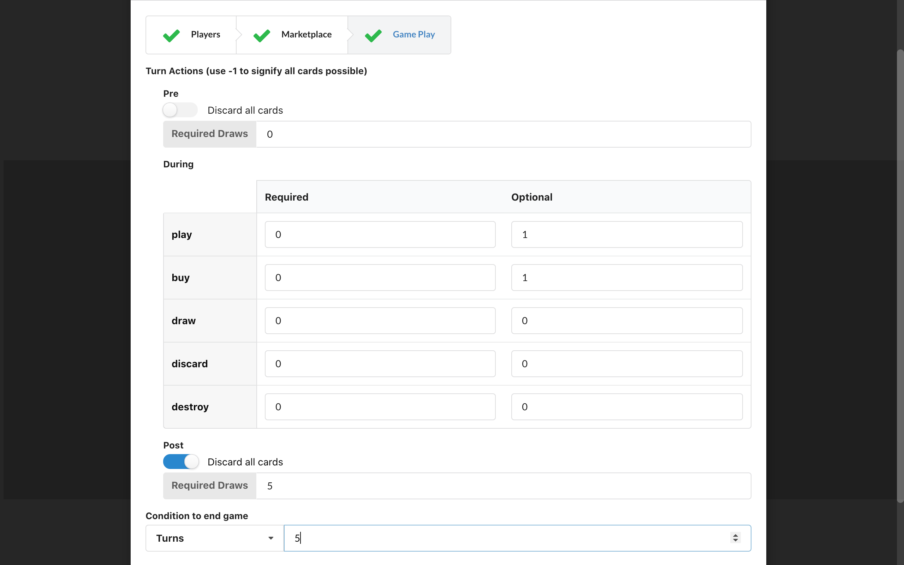
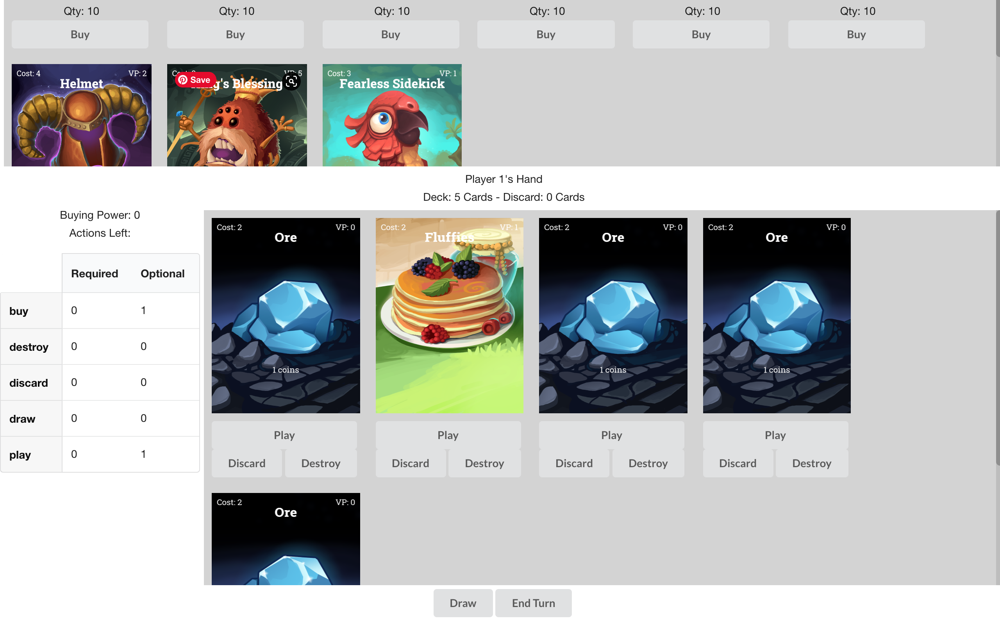

# Deck Builder API

This project contains a Python API, deployed using Heroku, that facilitates 1) custom card designing and 2) deck building card game playing.

For the first part, the creation of a deck, the API supports a set of card attributes that the user can specify and configure. Using those, the API creates cards that the user could print and play. Users can also choose from a set of art to use as a background for a card. This is implemented using Pillow. In order to have a nice intermediate way to test the API, flask-restx will be used to supply Swagger integration and convenient modelling.

For the second part, a set of cards can be specified to be used for a game. This part takes more data from the user about the rules of the game they want to set up and will automate these rules (ie card shuffling, hand drawing, etc). To do this, a database is required. Mongo, a noSQL database, is what's used.

### GUI Project

There is a separate JS GUI designed for this API. The code is here: https://github.com/lensesrequired/deck-builder-ui. The project is deployed here: https://deckbuilder.lensesrequired.com.

#### Here are some screenshots:

Deck Builder and Card Editor

Settings

Gameplay

### File structure:
- wsgi.py: imports and runs the app
- app: holds all of the components of the api
  - main.py: starts up a flask rest api and connects to the mongodb, also lists all of the API endpoints and their implementations.
  - models: contains models for each type of object the API requests
  - fonts: contains the fonts needed for the image creation
  - card_helpers, deck_helpers, and game_helpers: holds the respective creation and utility functions for each type of object

# Local Development
The following is what you will need for local development. Alternatively, you can use this app from https://deck-builder-api.herokuapp.com/
## Requirements
- Python 3.7 or higher
- You will need to install packages using pip

## Installation 
1) Clone this repository to a local directory on your computer
2) Use pip to install the required third party packages:  `pip3 install -r requirements.txt`

## Usage
To start the API, navigate to the root of the repository folder and run `flask run`.
Go to a web browser and go to `localhost:5000`, this will present you with a Swagger doc where you can test out the endpoints.
For more information on Swagger, read here: https://swagger.io/tools/swagger-ui/

Alternatively, you can make calls to the API from other local development projects using `localhost:5000` as the root domain and any path shown on the Swagger doc.

# Known issues
This project was developed parallel to a Javascript UI. That UI is hosted at https://deckbuilder.lensesrequired.com/ and does ensure good data. So, this API is not fool proof against bad data and there might be type errors thrown, rather than caught, if you don't follow the data types exactly as laid out by the Swagger models. You can see the models my running the project, and going to `localhost:5000`. At the bottom of that page there will be dropdowns for models of what the API expects from the user.
