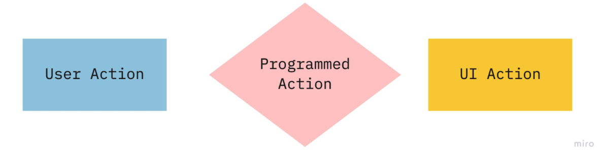
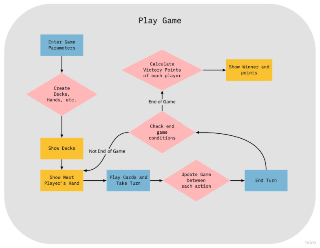
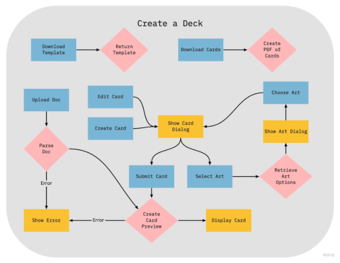

## General Description

This project is two parts, the first part being a UI written in React and deployed using Vercel that is simply a nice interface for a Python API, deployed using Heroku. This API facilitates 1) deck building card game creation (making the cards to play) and 2) deck building card game playing. A deck building game example can be found here. I am a frontend web developer by profession and use React on the daily, so the idea is a Flask backend with a React frontend. 
For the first part, the creation of a deck, the API supports a set of card attributes that the user can specify and configure. Using those, the API creates cards that the user could print and play. Users can also choose from a set of art to use as a background for a card. This is implemented using Pillow. In order to have a nice intermediate way to test the API, flask-restx will be used to supply Swagger integration and convenient modelling.
For the second part, these cards are of a playable game online. This game is playable on a local machine where you pass the laptop. This part takes more data from the user about the rules of the game they want to set up and will implement these rules programmatically (so card shuffling, hand drawing, etc will be implemented by the API). To do this, a database is required. Mongo, a noSQL database has a nice client library and is flexible with its data structures as a noSQL database.

## User Flow

#### GUI Deck Creator

This user lands on the web app and is shown a Create a Deck page. To start creating a deck, they click Add Card. This pops up a dialog box where the user can pick out art and input card details such as name, description, action, cost, point value, etc.. Picking out the art, there will be a library of art to choose from, by clicking on the Art space, they’ll have another dialog box that shows them the choices, allows them to filter, etc.. The inputs will be mostly textboxes where they just free form enter text or numbers. Once all the fields are entered (or as many of them as the user so chooses), they will click an Add button.
The dialog box will close and in the space below the button on the Create a Deck page, there will be a preview of the card they just created and a text box for them to enter the Quantity they will want in their deck (the default is 1). 
The user will continue to add cards until they have created their entire deck. When they are finished adding cards, they can choose to Export them by button click. This will download a PDF they can print out and cut in order to use the cards. 
- The art is served from another Vercel project (https://deck-builder-cards.now.sh/)
- When creating the card for display, PIL/Pillow will be used to put the text on the image. All images will have a similar overlay.
- Cards will need some way to be rendered less frequently than every call but cannot be stored in Mongo with the rest of the data due to storage limitations.
- PDF will also be created using Pil/Pillow.

#### Upload Deck Creator

This user lands on the web app and is shown a Create a Deck page. Instead of clicking Add Card, this user clicks Upload and chooses a file from their computer. Turns out, this file is not in the correct format though! The user is shown a dialog with an error and given the option to download a template (this template is also available from the original screen). The user downloads the template and now uses it to see where the data he provided wasn’t quite right (turns out he forgot the required field of Name).
Once his file is fixed he uploads it through the same flow as before, this time all the cards in his JSON get thrown into the space below the buttons. He’s now able to click on a given card to make finishing touches through the same dialog the GUI User used or edit quantities of cards. Just like the previous user, he can now export his deck as actual cards.
- Pretty much same details as above
- Flask-restx will convert the data given by the client side into Python lists and dictionaries auto-magically making it easy to parse through.

#### Game Player

This user creates a deck, like either of the users above, except instead of exporting the desk, she chooses to click Play Game! She is directed to a new page which pops up a dialog box that allows her to set up a game, it asks for how many players there are, what the starting hand size is what the starting player deck consists of, what cards belong on the table to be purchased, what a turn consists of, and what the triggers are for the end of the game. Once she hits the submit button on this dialog, the dialog disappears and the page loads up her game.
The rest of her actions are playing out the game based on the parameters she gave. The decks will be laid out with the cards she specified and she’ll be able to see her hand. The game creator always gets to go first so she will see her hand and take her turn. On her turn, she will go through the sequences she specified, usually a certain number of actions (buying or playing cards), discarding her remaining cards, and redrawing her next hand. She will then click the Next Player button and her hand will hide and she can pass the laptop to the next player. That player will click Start Turn and then will go through the same actions the game creator did.
Once the conditions for the end of a game are met, the end of the game is triggered and the game will display the number of victory points in every player's deck and a winner is announced. 
- The game state should be tracked server/Flask side and React will just render what it’s given.

## Technical Flow

